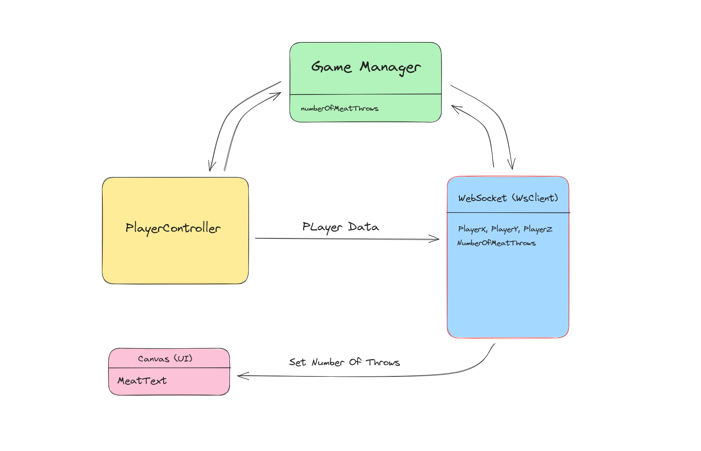
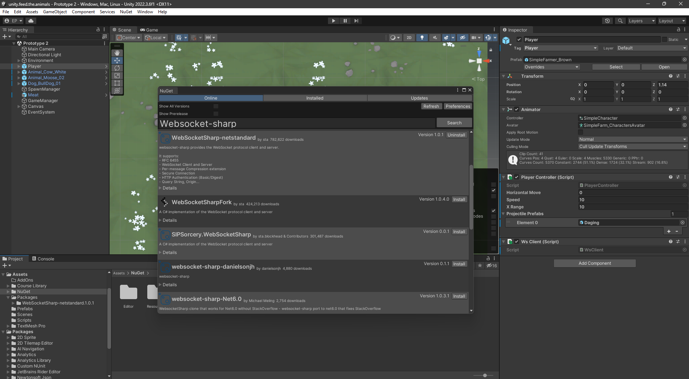

# Save Unity Game Data Using Node.js and GridDB

## Introduction

In this post, we will build a simple game called **Feed The Animals**. This game uses Node.js as a backend server and the GridDB database as storage.

## Run the Project

Clone the project [source code](https://github.com/junwatu/unity-node.js-griddb) from the GitHub repository.

```shell
git clone https://github.com/junwatu/unity-node.js-griddb.git
```

Change the directory into the project source code.

```shell
cd unity-node.js-griddb
```

Install the Node.js dependencies for the game server.

```shell
cd app\server
npm install
```

### Game Server

Before running the game, you should run the game server first. Please go to the project source code and folder  `app\server` if you haven't and run the following command in the terminal:

```sh
npm run start
```

The server's default host and port settings are in the `.env` file. Please change it if you want to run the server on another IP address and port. For example, to run the game server on IP `192.168.0.11` and the port is `9000`. Open the `.env` file and edit the `GAME_SERVER` variable.

```sh
GAME_SERVER=http://192.168.0.11:9000
```

And then run or restart the game server.

### Game Build

#### Windows Binary `.exe`

This game build is running on the Windows OS machine. Please download the binary build on this link:

  [https://github.com/junwatu/unity-node.js-griddb/releases/download/demo/FeedTheAnimals.Windows-x64.zip](https://github.com/junwatu/unity-node.js-griddb/releases/download/demo/FeedTheAnimals.Windows-x64.zip).


Then extract it, and if you change the default game server address, you should change the IP address for the game, too. Open the `config.json` file, then edit the `WebSocketURL`:

```json
{
  "WebSocketURL": "http://192.168.0.11:9000"
}
```

After that, you can run the game by clicking the `feed.the.animals.exe` file!

The gameplay is simple: feed the animal, and if you have failed to feed a few animals, you will lose, which means game over!


This game only have three key functions:

| Control Key  | Action                                |
|-------------|---------------------------------------|
| **Left Arrow** or **A** | For the left movement.             |
| **Right Arrow** or **D** | For the right movement.           |
| **Space Bar**   | For throwing a food at the animal.    |

## **The Building Blocks: Unity, Node.js, WebSocket, and GridDB**

Accurately and promptly saving every action, decision, and game state is crucial for seamless gameplay, especially in multiplayer scenarios or games requiring consistent syncing. We will build the game using the **Unity** game engine with the backend stack **Node.js** and **GridDB** database. Let's examine the importance of each:

### [**Unity**](https://unity.com/)

Unity is a top game development platform with a versatile engine for crafting 2D sprites and 3D worlds. The platform has a user-friendly interface, rich assets, and a supportive community to help create immersive gaming experiences for mobile devices, desktops, and VR headsets.

### [**Node.js**](https://nodejs.org/en/download)

Node.js allows developers to create efficient and scalable backend services using JavaScript, a language mostly recognized for web-based applications. Its event-driven, non-blocking I/O model is ideal for handling numerous simultaneous connections, making it perfect for games with a large user base. It acts as a bridge, connecting Unity games to databases such as GridDB.

### [**GridDB**](https://www.griddb.net/)

In real-time gaming, efficient data storage is crucial. GridDB is a highly scalable, available, and durable database system designed for this purpose. Its architecture is tailored for IoT use cases, translating well into gaming. It ensures every player's action is captured and stored with low latency.

### **WebSocket: Bridging Unity and Node.js in Real-time**

In the fast-paced gaming world, where every move and second is critical, more than traditional request-response communication models may be required. This is where the power of [WebSocket](https://en.wikipedia.org/wiki/WebSocket) comes in.

- **Basics of WebSocket:** 
  WebSocket offers a different approach to the traditional HTTP model. Rather than waiting for a response after sending a request, WebSocket creates a full-duplex communication channel over one long-lasting connection. This enables simultaneous sending and receiving of data without constantly disconnecting. The connection is established through an HTTP connection handshake, which is then upgraded for use with WebSocket. This consistent and uninterrupted connection is perfect for applications that require real-time feedback, as data transfer is instantaneous.

- **Importance of real-time communication in games:** 
  When gaming, players want quick responses to their moves. In multiplayer shooter games, communication can determine whether a team wins or loses, and in real-time strategy games, decisions need to be made and executed without delay. To meet these expectations, game developers rely on WebSocket. These tools help minimize delays and ensure that players' actions are synchronized across various platforms and devices. With WebSocket, gamers can enjoy a seamless and engaging experience.

## System Architecture

This project consists of three main stacks, as we described earlier: Unity, Node.js, and GridDB database. The system diagram is very simple; we can use Node.js and GridDB as backend servers, and the communication between the Unity game and the backend server is through WebSocket technology.


This project uses two main programming languages: C# for game development and JavaScript running on Node.js.

## Installation

### Setting up Node.js

The project discussed in this blog post utilizes Node.js LTS version 18, and it is recommended that you have the same version installed. To check if you have Node.js installed, run the following command:

```bash
node --version
```

If Node.js is not installed or you have an older version, it is recommended to upgrade or install Node.js LTS from their official website [nodejs.org](https://nodejs.org/en/download).

### Setting up GridDB

GridDB is easy to setup. Please go to this [link](https://docs.griddb.net/latest/gettingstarted/using-apt/) for fresh installation on Ubuntu or [here](https://docs.griddb.net/latest/gettingstarted/wsl/) to install it on Windows via WSL (Windows Subsystem Linux).

If you already have it in your system, check if the griddb service is running with this command

```bash
sudo systemctl status gridstore
```

This Ubuntu OS command line output shows the griddb service is running:

```bash
● gridstore.service - GridDB database server.
     Loaded: loaded (/lib/systemd/system/gridstore.service; enabled; vendor preset: enabled)
     Active: active (running) since Tue 2023-07-04 04:47:12 +07; 9h ago
   Main PID: 575 (gsserver)
      Tasks: 34 (limit: 7017)
     Memory: 144.7M
     CGroup: /system.slice/gridstore.service
             └─575 /usr/bin/gsserver --conf /var/lib/gridstore/conf

Jul 04 04:47:08 GenAI systemd[1]: Starting GridDB database server....
Jul 04 04:47:09 GenAI gridstore[381]: Starting gridstore service:
Jul 04 04:47:12 GenAI gridstore[526]: ..
Jul 04 04:47:12 GenAI gridstore[526]: Started node.
Jul 04 04:47:12 GenAI gridstore[381]: [ OK ]
Jul 04 04:47:12 GenAI systemd[1]: Started GridDB database server..
```

### Setting up Unity

In this post, we will use Windows OS for the Unity installation.

> This installation is optional because we don't discuss the game development from scratch here. If you want to dive into the Unity Editor and try the live development, please continue to install it.

#### Unity Editor

For this project, we will use Unity 2022 LTS and to install it you need to install Unity Hub first. Please go here [Unity Hub](https://public-cdn.cloud.unity3d.com/hub/prod/UnityHubSetup.exe) to install it. You have to install **Unity 2022.3.6f1** directly from Unity Hub for better project management.

> **What is the Unity Hub?**
> Unity Hub is used to manage multiple installations of the Unity Editor, create new projects, and access your work.


After installed,you can import the game project source code and assets in the folder:

 ```shell
 app\game\unity.feed.the.animals
 ```


After that you can open the game project source and assets in the Unity Editor.


## Project Codes

### Node.js and WebSocket Integration

Integrating Node.js with WebSocket is easy using [`ws`](https://github.com/websockets/ws) npm package. This npm package is simple to use, blazing fast, and thoroughly tested WebSocket client and server implementation, and `ws` is only available on the server, which means you cannot use it in the browser because the browser already has WebSocket implementation.

#### Node.js HTTP Server

This code sets up a basic HTTP and WebSocket server using Node.js and various Node.js packages. It also exposes some HTTP routes and connects to a database service to get game data:

```js
// index.js
import express from 'express';
import http from 'http';
import cors from 'cors';
import path from 'path';
import 'dotenv/config';
import url from 'url';

import setupWebSocket from './websocket.js';
import { __dirname } from './libs/dirname.js';
import { getAllData } from "./griddbservice.js";
import { createRequire } from 'module'; 

const require = createRequire(import.meta.url); 
const WebSocket = require('ws');

const app = express();

const parsedUrl = url.parse(process.env.GAME_SERVER_URL);
const hostname = parsedUrl.hostname;
const port = parsedUrl.port || 8080; 

const server = http.createServer(app);

const wss = new WebSocket.Server({ server });

setupWebSocket(wss);

const publicPath = path.resolve(`${__dirname}`, './public');

app.use(express.static(publicPath));
app.use(cors());

app.get('/', (req, res) => {
	res.send('Unity Game Server!');
});


app.get('/api/gamedata', async (req, res) => {
	try {
		const data = await getAllData();
		res.json(data); 
	} catch (err) {
		console.error(err);
		res.status(500).send('Internal Server Error');
	}
});

server.listen(port, () => {
	console.log(`HTTP and WebSocket server running on http://${hostname}:${port}`);
});

```

The HTTP server will read the `env` file and get the `GAME_SERVER_URL` environment variable first before the HTTP server runs:

```js
const parsedUrl = url.parse(process.env.GAME_SERVER_URL);
const hostname = parsedUrl.hostname;
const port = parsedUrl.port || 8080;
```

The above code will parse `GAME_SERVER_URL` and extract `hostname` and `port`. If you don't define the port in the `env` file, it will default to port `8080`.

#### HTTP Routes

The HTTP server also exposes some routes on is the homepage, and the other to get the game data list:

| HTTP Method | Route         | Description                            | Response Type      |
|-------------|---------------|----------------------------------------|--------------------|
| GET         | `/`           | Returns a simple text message          | Text: "Unity Game Server!"   |
| GET         | `/api/gamedata`| Fetches game data from a service       | JSON or 500 Internal Server Error |

**Note:** This table only covers HTTP routes and does not include WebSocket routes, which are set up by the `setupWebSocket(wss)` function but not detailed in the given code.


#### WebSocket Server

The WebSocket server is attached to the HTTP server, so when the HTTP server is run, the WebSocket server will run too:

```js
const wss = new WebSocket.Server({ server });

setupWebSocket(wss);
```

The `setupWebSocket()` is the main function that handles the connection between the game server and the Unity game. Let's see the code:

```js
// websocket.js
import { saveData, getAllData } from './griddbservice.js';

function setupWebSocket(wss) {
	wss.on('connection', function connection(ws) {
		ws.on('message', async (data) => {

			let readableData;

			// Check if the data is in JSON format
			try {
				readableData = JSON.parse(data.toString('utf8'));
			} catch (e) {
				console.log('Received data is not JSON. Ignoring...');
				return;
			}

			// If data is of type "save", then save it
			if (readableData.type === 'save') {
				const playerposition = {
					x: readableData.PlayerX,
					y: readableData.PlayerY,
					z: readableData.PlayerZ
				};
				const numberofthrows = readableData.NumberOfMeatThrows;
				const gameover = false;

				await saveData({ playerposition, numberofthrows, gameover });
				ws.send(JSON.stringify(readableData))
			} else if (readableData.type === 'getAll') {
				const allData = await getAllData();
				ws.send(JSON.stringify(allData));
			}

			console.log('data received \n %o', readableData);

		});
	});


	wss.on('listening', () => {
		console.log('WebSocket server is listening');
	});
};

export default setupWebSocket;
```

When in the connection state, WebSocket will listen to the message from the Unity game. Because of the nature of WebSocket, any data will be received instantly from the Unity game (client). In this code, we will accept JSON data only:

```js
try {
    readableData = JSON.parse(data.toString('utf8'));
} catch (e) {
    console.log('Received data is not JSON. Ignoring...');
return;
}
```

The JSON data from the Unity game contains the last player's movement and the number of meat throws.

```js
const playerposition = {
		x: readableData.PlayerX,
		y: readableData.PlayerY,
		z: readableData.PlayerZ
};
const numberofthrows = readableData.NumberOfMeatThrows;
```
This data will later be saved to the GridDB database.

### WebSocket Events

| Event    | Message Type | Description                                                       | Response/Action         |
|----------|-------------|--------------------------------------------------------------------|--------------------------|
| on message | `save`    | Saves the player's position, and number of meat throws             | Echoes received JSON data|
| on message | `getAll`  | Sends all saved game data to the client (future use)               | Sends all game data as JSON|
| on listening | N/A      | Indicates WebSocket server is listening for incoming connections  | Logs a message to console|

The `setupWebSocket` function hooks into the WebSocket server and listens for different types of events:

- **`connection`**: Whenever a new WebSocket connection is established, it sets up the following message handlers:
  - **`message`**: Listens for incoming messages. Depending on the `type` field in the message (`save` or `getAll`), it either saves the data or retrieves all saved game data, sending it back to the client.
- **`listening`**: Logs that the WebSocket server is actively listening for incoming connections.

### Storing Game Progress

To store the game data in the GridDB database is very easy. In the WebSocket server code, we use two methods, `saveData()` and `getAllData()`.

```js
import { saveData, getAllData } from './griddbservice.js';
```
The `griddbservice.js` is a GridDB service file that handles the logic related to database operations. This makes it easier to update the database logic and to make the CRUD operations with GridDB more modular.

```js
// griddbservice.js
import * as GridDB from './libs/griddb.cjs';
import { generateRandomID } from './libs/rangen.js';

const { collectionDb, store, conInfo, containerName } = await GridDB.initGridDbTS();

export async function saveData({ playerposition, numberofthrows, gameover }) {
	const id = generateRandomID();

	// Serialize player position to a JSON string (if needed)
	const playerpositionStr = JSON.stringify(playerposition);
	const numberofthrowsStr = String(numberofthrows);
	const gameoverStr = String(gameover);

	// Now you can safely insert them into the database as strings
	const playerState = [parseInt(id), playerpositionStr, numberofthrowsStr, gameoverStr];
	const saveStatus = await GridDB.insert(playerState, collectionDb);
	return saveStatus;
}

export async function getAllData() {
	return await GridDB.queryAll(conInfo, store);
}
```

The game data is saved using the `saveData()` function. This function has the signature:

```js
async function saveData({ playerposition, numberofthrows, gameover })
```

The `saveData()` function will save three game data: `playerposition`, `numberofthrows`, and `gameover` into the GridDB database.

The `getAllData()` will return all the game data that is saved in the GridDB database. You can get this data via browser by running the HTTP server URL:

```shell
http://localhost:8080/api/gamedata
```

Please note that if you change the HTTP URL server in the `env` file, the above URL will also change.

### Game Architecture



The **Feed the Animals** game architecture generally can be described as this diagram. In this diagram, the **WebSocket (WsClient)** component is sending out various data points:

- **PlayerX, PlayerY, PlayerZ**: The position of the player, which is probably gathered from the PlayerController.

- **NumberOfMeatThrows**: This is directly read from GameManager.

These data points are serialized as a JSON and then sent through the WebSocket connection.

### Unity Meets WebSocket

#### WebSocket NuGet

Unity doesn't support WebSocket natively, and to solve this problem, we will use the WebSocket package from NuGet. As you know, Unity uses C#, a language different from our Node.js server, which uses JavaScript. 

> **What is NuGet?**  
> NuGet is the package manager for .NET. The NuGet client tools provide the ability to produce and consume packages. The NuGet Gallery is the central package repository used by all package authors and consumers.

For better package management in this project, we have used [NuGetForUnity](https://github.com/GlitchEnzo/NuGetForUnity). The Unity package can be installed from this [link](https://github.com/GlitchEnzo/NuGetForUnity/releases).

> **NuGetForUnity** is a NuGet client built from scratch to run inside the Unity Editor. NuGet is a package management system that makes it easy to create packages that are distributed on a server and consumed by users.

The WebSocket package that we use for this project is the `WebSocketSharp-netstandard` package.



#### WebSocket Client

This code initializes a WebSocket client when a game starts and then, during the game, sends data to the WebSocket server when the player hits the Spacebar. This data includes information about the player's position in the game world and a game-specific metric called `NumberOfMeatThrows`:

```cs
// WsClient.cs
public class WsClient : MonoBehaviour
{
    WebSocket ws;

    void Start()
    {
      //...
    }

    void Update()
    {
        if (ws == null)
        {
            return;
        }
        if (Input.GetKeyDown(KeyCode.Space))
        {
            ws.Send("Save Data...");
            Dictionary<string, object> dataToSave = new Dictionary<string, object>();

            //Add player position
            Vector3 playerPosition = GameObject.Find("Player").transform.position;
            dataToSave.Add("PlayerX", playerPosition.x);
            dataToSave.Add("PlayerY", playerPosition.y);
            dataToSave.Add("PlayerZ", playerPosition.z);
            dataToSave.Add("NumberOfMeatThrows", GameManager.Instance.numberOfMeatThrows);
            dataToSave.Add("type", "save");

            // Convert dictionary to JSON and send it
            string json = JsonConvert.SerializeObject(dataToSave);
            ws.Send(json);
        }
    }
}

```

**Game Loop: Update() Method**

This method gets called once per frame, allowing for real-time interaction. If the WebSocket client `ws` is not initialized, the method simply returns without doing anything.

It checks if the **Spacebar** key is pressed. If pressed, it gathers some data and sends it to the WebSocket server:

- The position of a GameObject named **Player** is stored in a dictionary.
- The number of "meat throws", is also stored.
- This dictionary data is then converted to a JSON string and sent to the game server via WebSocket.
