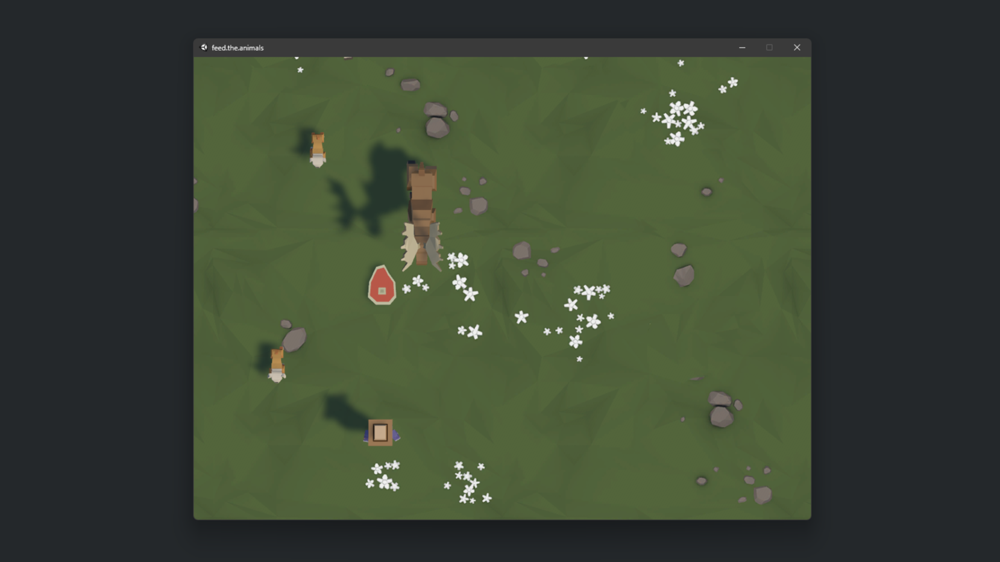

# Save Unity Game Data Using Node.js and GridDB

## Introduction

In this post we will build a simple game called **Feed The Animals**. This game is using Node.js as a backend server and using GridDB database as storage.

## Run the Project

Clone the project [source code](https://github.com/junwatu/unity-node.js-griddb) from the GitHub repository. 

```shell
git clone https://github.com/junwatu/unity-node.js-griddb.git
```

change the directory into the project source code

```shell
cd unity-node.js-griddb
```

Install the Node.js server dependencies

```shell
cd app\server
npm install
```

### Game Server

Before running the game, you should run the game server first. Please, go to the project source code and folder  `app\server` if you haven't and run the following command in the terminal:

```sh
npm run start
```

The default host and port setting for the server is in the `.env` file. Please change it if you want to run the server on another IP address and port. For example, to run the game server on IP `192.168.0.11` and the port is `9000`. Open `.env` file and edit `GAME_SERVER` variable.

```sh
GAME_SERVER=http://192.168.0.11:9000
```

and then run or restart the game server.

### Game Build

#### Windows Binary `.exe`

This game build is running on the Windows OS machine. Go to the project source and go to the folder `app\game\unity.feed.the.animals\Build` then double click file with then name `feed.the.animals.exe`.

There will be a game setting configuration window. You can choose other  **Screen resolution** and the **Graphics quality** or leave as it is.


The gameplay is simple, that is feed the animal and if you have failed to feed a few animals then you will loose, means game over!



This game only have three keys function:

| Control Key  | Action                                |
|-------------|---------------------------------------|
| **Left Arrow** or **A** | For the left movement.             |
| **Right Arrow** or **D** | For the right movement.           |
| **Space Bar**   | For throwing a food to the animal.    |

## **The Building Blocks: Unity, Node.js, WebSocket, and GridDB**

Accurately and promptly saving every action, decision, and game state is crucial for seamless gameplay, especially in multiplayer scenarios or games requiring consistent syncing. We will build the game using **Unity** game engine with the backend stack **Node.js**, and **GridDB** database. Let's examine the importance of each:

### [**Unity**](https://unity.com/)

Unity is a top game development platform with a versatile engine for crafting 2D sprites and 3D worlds. The platform has a user-friendly interface, a rich array of assets, and a supportive community to help create immersive gaming experiences for mobile devices, desktops, and VR headsets.

### [**Node.js**](https://nodejs.org/en/download)

Node.js allows developers to create efficient and scalable backend services using JavaScript, a language mostly recognized for web-based applications. Its event-driven, non-blocking I/O model is ideal for handling numerous simultaneous connections, making it perfect for games with a large user base. It acts as a bridge, connecting Unity games to databases such as GridDB.

### [**GridDB**](https://www.griddb.net/)

In real-time gaming, efficient data storage is crucial. GridDB is a highly scalable, available, and durable database system designed for this purpose. Its architecture is tailored for IoT use-cases, translating well into gaming, ensuring every player action is captured and stored with low latency.


### **WebSocket: Bridging Unity and Node.js in Real-time**

In the fast-paced world of gaming, where every move and second is critical, traditional request-response communication models may not be sufficient. This is where the power of [WebSocket](https://en.wikipedia.org/wiki/WebSocket) comes in.

- **Basics of WebSocket:** WebSocket offer a different approach to the traditional HTTP model. Rather than waiting for a response after sending a request, WebSocket create a full-duplex communication channel over one long-lasting connection. This enables simultaneous sending and receiving of data without the need to constantly reconnect. The connection is established through an HTTP connection handshake, which is then upgraded for use with WebSocket. This consistent and uninterrupted connection is perfect for applications that require real-time feedback, as data transfer is instantaneous.

- **Importance of real-time communication in games:** When it comes to gaming, players want quick responses to their moves. In multiplayer shooter games, communication can determine whether a team wins or loses, and in real-time strategy games, decisions need to be made and executed without delay. To meet these expectations, game developers rely on WebSocket. These tools help minimize delays and ensure that players' actions are synchronized across various platforms and devices. With WebSocket, gamers can enjoy a seamless and engaging experience.

## System Architecture

This project consist of three main stacks as we described earlier: Unity, Node.js, and GridDB database. The system diagram is very simple, we can use Node.js and GridDB as backend server and the communication between  Unity game and the backend server is through WebSocket technology.


In this project we use two main programming languages one is C# for the game development and the other is JavaScript running on Node.js.

## Installation

### Setting up Node.js

The project discussed in this blog post utilizes Node.js LTS version 18, and it is recommended that you have the same version installed. To check if you have Node.js installed, run the following command:

```bash
node --version
```

If Node.js is not installed or you have an older version, it is recommended to upgrade or install Node.js LTS from their official website [nodejs.org](https://nodejs.org/en/download).

### Setting up GridDB

GridDB is easy to setup. Please go to this [link](https://docs.griddb.net/latest/gettingstarted/using-apt/) for fresh installation on ubuntu or [here](https://docs.griddb.net/latest/gettingstarted/wsl/) to install it on Windows via WSL (Windows Subsystem Linux).

If you alreaady have it in your system, check if the griddb service is running with this commmand

```bash
sudo systemctl status gridstore
```

This Ubuntu OS command line output shows the griddb service is running:

```bash
● gridstore.service - GridDB database server.
     Loaded: loaded (/lib/systemd/system/gridstore.service; enabled; vendor preset: enabled)
     Active: active (running) since Tue 2023-07-04 04:47:12 +07; 9h ago
   Main PID: 575 (gsserver)
      Tasks: 34 (limit: 7017)
     Memory: 144.7M
     CGroup: /system.slice/gridstore.service
             └─575 /usr/bin/gsserver --conf /var/lib/gridstore/conf

Jul 04 04:47:08 GenAI systemd[1]: Starting GridDB database server....
Jul 04 04:47:09 GenAI gridstore[381]: Starting gridstore service:
Jul 04 04:47:12 GenAI gridstore[526]: ..
Jul 04 04:47:12 GenAI gridstore[526]: Started node.
Jul 04 04:47:12 GenAI gridstore[381]: [ OK ]
Jul 04 04:47:12 GenAI systemd[1]: Started GridDB database server..
```

### Setting up Unity

In this post we will use Windows OS for the Unity installation.

#### Unity Editor

For this project we will use Unity 2022 LTS and to install it you need to install Unity Hub first. Please go here [Unity Hub](https://public-cdn.cloud.unity3d.com/hub/prod/UnityHubSetup.exe) to install it.

> **What is the Unity Hub?**
> Use the Unity Hub to manage multiple installations of the Unity Editor, create new projects, and access your work.

You have to install **Unity 2022.3.6f1** directly from Unity Hub for better project management.


After installed you can import the game project source code and assets in in the folder:

 ```shell
 app\game\unity.feed.the.animals
 ```


After that you can open the game project source and assets in the Unity Editor.


## Project Codes

### Node.js and WebSocket Integration

[DRAFT]

### Unity Meets WebSocket

[DRAFT]

